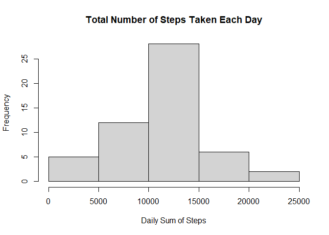
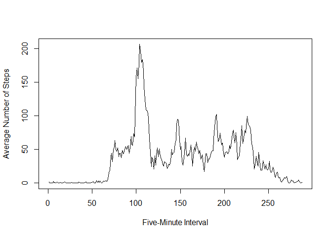
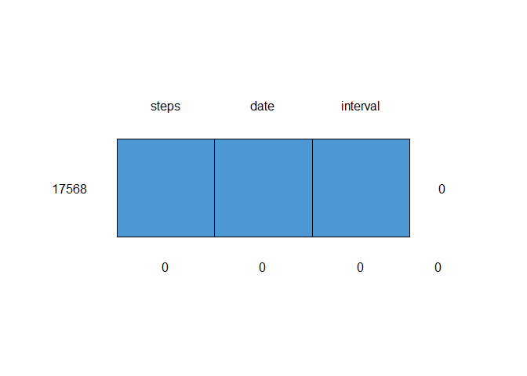
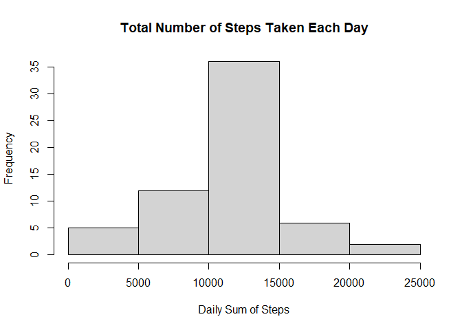
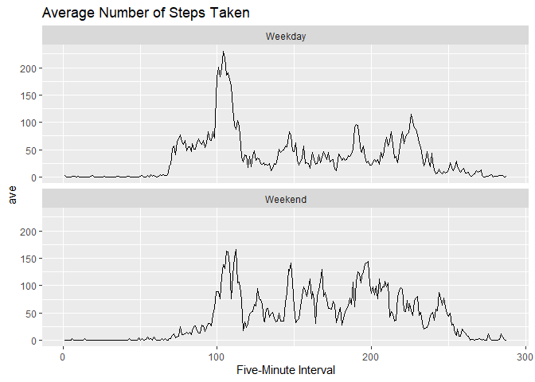

```r
knitr::opts_chunk$set(echo = TRUE, message = FALSE, fig.align = "center")
```


## Loading and preprocessing the data

Show any code that is needed to

Load the data (i.e. `read.csv()`)


```r
data <- read.csv(unz("activity.zip", "activity.csv"))
str(data)
```

```
## 'data.frame':	17568 obs. of  3 variables:
##  $ steps   : int  NA NA NA NA NA NA NA NA NA NA ...
##  $ date    : chr  "2012-10-01" "2012-10-01" "2012-10-01" "2012-10-01" ...
##  $ interval: int  0 5 10 15 20 25 30 35 40 45 ...
```

Process/transform the data (if necessary) into a format suitable for your analysis


```r
data$date <- as.Date(data$date)
data$interval <- factor(data$interval)
str(data)
```

```
## 'data.frame':	17568 obs. of  3 variables:
##  $ steps   : int  NA NA NA NA NA NA NA NA NA NA ...
##  $ date    : Date, format: "2012-10-01" "2012-10-01" ...
##  $ interval: Factor w/ 288 levels "0","5","10","15",..: 1 2 3 4 5 6 7 8 9 10 ...
```

## What is mean total number of steps taken per day?

For this part of the assignment, you can ignore the missing values in the dataset.

Calculate the total number of steps taken per day


```r
library(dplyr)
#two ways

#this displays NA outputs for days without steps
sum_daily <- data %>% group_by(date) %>% summarise(daily = sum(steps))

#how to do the same using aggregate fcn
#aggregate(steps ~ date, data = data, sum, na.rm=FALSE, na.action=NULL)
```

If you do not understand the difference between a histogram and a barplot, research the difference between them. Make a histogram of the total number of steps taken each day

| With bar charts, each column represents a group defined by a categorical variable; and with histograms, each column represents a group defined by a continuous, quantitative variable. See reference [here](https://stattrek.com/statistics/charts/histogram.aspx)
| 


```r
hist(x = sum_daily$daily, main="Total Number of Steps Taken Each Day", xlab="Daily Sum of Steps")
```



Calculate and report the mean and median of the total number of steps taken per day.


```r
# includes other things
#summary(sum_daily$daily)

# only the necessary
vec<-c(mean(sum_daily$daily, na.rm=TRUE), median(sum_daily$daily, na.rm=TRUE))
names(vec) <- c("mean", "median")
vec
```

```
##     mean   median 
## 10766.19 10765.00
```

## What is the average daily activity pattern?

Make a time series plot (i.e. [`type = "l"`]{style="color: red;"} of the 5-minute interval (x-axis) and the average number of steps taken, averaged across all days (y-axis)


```r
int_mean <- aggregate(steps ~ interval, data = data, mean)
plot(int_mean$steps, type = "l", ylab="Average Number of Steps", xlab="Five-Minute Interval")
```




## Imputing missing values

Which 5-minute interval, on average across all the days in the dataset, contains the maximum number of steps?


```r
int_mean[which.max(int_mean$steps),]
```

```
##     interval    steps
## 104      835 206.1698
```

Note that there are a number of days/intervals where there are missing values (coded as `NA`). The presence of missing days may introduce bias into some calculations or summaries of the data.

Calculate and report the total number of missing values in the dataset (i.e. the total number of rows with `NA`s)

*I really want to use MICE but I do not know much about it yet; next time, I will try.*


```r
sum(is.na(data$steps))
```

```
## [1] 2304
```

```r
mice::md.pattern(data)
```


```
##       date interval steps     
## 15264    1        1     1    0
## 2304     1        1     0    1
##          0        0  2304 2304
```

Devise a strategy for filling in all of the missing values in the dataset. The strategy does not need to be sophisticated. For example, you could use the mean/median for that day, or the mean for that 5-minute interval, etc.


```r
library(doParallel)
I<-data$steps
k<-
foreach(i=1:length(I), .combine="c") %do% {
  ifelse(is.na(data$steps[i]),
         data$steps[i] <- int_mean$steps[which(int_mean$interval==data$interval[i])],
         data$steps[i] <- data$steps[i])
}
```

Create a new dataset that is equal to the original dataset but with the missing data filled in.


```r
new<-data
head(new)
```

```
##       steps       date interval
## 1 1.7169811 2012-10-01        0
## 2 0.3396226 2012-10-01        5
## 3 0.1320755 2012-10-01       10
## 4 0.1509434 2012-10-01       15
## 5 0.0754717 2012-10-01       20
## 6 2.0943396 2012-10-01       25
```

```r
mice::md.pattern(new)
```

```
##  /\     /\
## {  `---'  }
## {  O   O  }
## ==>  V <==  No need for mice. This data set is completely observed.
##  \  \|/  /
##   `-----'
```



```
##       steps date interval  
## 17568     1    1        1 0
##           0    0        0 0
```

Make a histogram of the total number of steps taken each day and Calculate and report the mean and median total number of steps taken per day. Do these values differ from the estimates from the first part of the assignment? What is the impact of imputing missing data on the estimates of the total daily number of steps?


```r
sum_daily <- new %>% group_by(date) %>% summarise(daily = sum(steps))

hist(x = sum_daily$daily, main="Total Number of Steps Taken Each Day", xlab="Daily Sum of Steps")
```



```r
vec<-c(mean(sum_daily$daily, na.rm=TRUE), median(sum_daily$daily, na.rm=TRUE))
names(vec) <- c("mean", "median")
vec
```

```
##     mean   median 
## 10766.19 10766.19
```

## Are there differences in activity patterns between weekdays and weekends?

For this part the [`weekdays()`]{style="color: red;"} function may be of some help here. Use the dataset with the filled-in missing values for this part.


```r
data_with_wkday <- new %>% mutate(day = weekdays(date))
data_with_wkday$day<-ifelse(data_with_wkday$day %in% c("Saturday", "Sunday"), "Weekend", "Weekday")
data_with_wkday[, c("interval", "day")] <- lapply(data_with_wkday[, c("interval", "day")], factor)
str(data_with_wkday)
```

```
## 'data.frame':	17568 obs. of  4 variables:
##  $ steps   : num  1.717 0.3396 0.1321 0.1509 0.0755 ...
##  $ date    : Date, format: "2012-10-01" "2012-10-01" ...
##  $ interval: Factor w/ 288 levels "0","5","10","15",..: 1 2 3 4 5 6 7 8 9 10 ...
##  $ day     : Factor w/ 2 levels "Weekday","Weekend": 1 1 1 1 1 1 1 1 1 1 ...
```

Make a panel plot containing a time series plot (i.e. `type = "l"`) of the 5-minute interval (x-axis) and the average number of steps taken, averaged across all weekday days or weekend days (y-axis). See the README file in the GitHub repository to see an example of what this plot should look like using simulated data.


```r
forplots <- data_with_wkday %>% group_by(interval, day) %>% summarise(ave=mean(steps))

library(ggplot2)

ggplot(forplots, aes(x=as.numeric(interval), y=ave)) +
  geom_line() +
  facet_wrap(~day, ncol=1) +
  labs(title = "Average Number of Steps Taken",
       x = "Five-Minute Interval")
```


